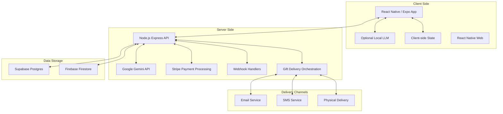

# Design Document: AI-Powered Gift Journey

## Overview

The Surprizen platform is designed to revolutionize gift-giving by creating
personalized, puzzle-based surprise journeys. The system uses AI (Gemma 3n) to
guide gift-givers through creating memorable experiences, while providing
recipients with an engaging puzzle journey leading to a delightful gift reveal.

This design document outlines the architecture, components, interfaces, data
models, error handling, and testing strategy for implementing the Surprizen MVP
based on the requirements document.

### Technology Stack Evaluation

After evaluating several technology options for building a multi-platform
solution, we recommend the following stack:

#### Frontend Framework: React Native / Expo

- **Rationale**: React Native provides true cross-platform development for iOS,
  Android, and web from a single codebase
- **Benefits**:
  - Faster development cycle compared to native development
  - Large ecosystem of libraries and components
  - Expo platform simplifies development and deployment
  - Excellent performance for UI-heavy applications
  - Hot reloading for faster development
  - Web support through React Native Web

#### Backend Framework: Node.js with Express

- **Rationale**: JavaScript across the entire stack simplifies development and
  resource sharing
- **Benefits**:
  - Consistent language between frontend and backend
  - Excellent performance for API-driven applications
  - Rich ecosystem of packages for all required functionality
  - Easy integration with Firebase and other cloud services
  - Scalable on serverless platforms like Cloud Run

#### LLM Integration Options

We'll support both local and cloud-based LLM processing:

1. **Cloud-based (Primary)**: Google Gemini API
   - **Benefits**: No device constraints, consistent performance, managed
     scaling, easier access than Vertex AI
   - **Considerations**: API costs, network latency, privacy considerations

2. **On-device (Optional)**: WebLLM for supported devices
   - **Benefits**: Privacy, reduced API costs, offline capabilities
   - **Considerations**: Device compatibility, performance variations

This hybrid approach allows us to serve all users while optimizing for privacy
and performance where possible.

## Architecture

The Surprizen platform follows a modern, scalable architecture with the
following key components:

### High-Level Architecture



### Key Architectural Decisions

1. **Cross-Platform Development**: Using React Native with Expo for iOS,
   Android, and web from a single codebase.
2. **Hybrid LLM Strategy**: Primary reliance on Google Gemini API with optional
   on-device processing for supported devices.
3. **JavaScript Full Stack**: Node.js/Express backend for consistency with React
   Native frontend.
4. **Serverless Backend**: Using Cloud Run for auto-scaling API services with
   zero minimum instances.
5. **Dual Database Strategy**:
   - Supabase Postgres for transactional data and persistent storage
   - Firebase Firestore for real-time updates and dashboard data
6. **Progressive Enhancement**: Cloud API fallback when client-side AI
   processing isn't supported.
7. **Mobile-First Design**: Optimized for mobile with responsive design for
   larger screens.

## Components and Interfaces

### 1. Authentication Component

**Purpose**: Handle user authentication and session management.

**Implementation**:

- Firebase Authentication UI for email and social login
- JWT token-based session management
- 30-day persistent sessions via secure cookies

**Interfaces**:

- `AuthService`: Manages authentication state and session persistence
- `AuthController`: Handles authentication routes and callbacks
- `CurrentUserContext`: Provides authentication state to the application

### 2. Vision Chatbot Component

**Purpose**: Guide users through defining their gift vision through
conversation.

**Implementation**:

- Google Gemini API (primary) or WebLLM wrapper (optional)
- Slot-filling conversation design pattern
- React Native speech recognition for voice input
- Quick-reply chips for common responses

**Interfaces**:

- `VisionChatService`: Manages conversation flow and slot-filling
- `ProfileCardComponent`: Displays and updates collected user preferences
- `SpeechRecognitionService`: Handles speech input processing
- `VisionToStrategyBridge`: Transfers completed vision to strategy phase

### 3. Strategy Chatbot Component

**Purpose**: Transform vision into concrete surprise strategy.

**Implementation**:

- Google Gemini API with strategy-specific prompt templates
- React Native collaborative decision interface for puzzle steps, channels, and
  difficulty
- Gift recommendation algorithm based on collected preferences

**Interfaces**:

- `StrategyChatService`: Manages strategy development conversation
- `GiftRecommendationEngine`: Generates gift options based on preferences
- `StrategyToStoryboardBridge`: Transfers completed strategy to storyboard phase

### 4. Storyboard Creator Component

**Purpose**: Generate visual representation of journey with editable steps.

**Implementation**:

- Journey generation using Google Gemini API
- React Native drag-and-drop interface for step reordering
- JSON schema validation for journey structure

**Interfaces**:

- `StoryboardGeneratorService`: Creates initial journey structure
- `StoryboardEditorComponent`: Provides UI for editing and reordering
- `JourneyValidator`: Ensures journey structure meets requirements

### 5. Payment and Checkout Component

**Purpose**: Process payments and finalize journey details.

**Implementation**:

- Embedded Stripe Elements for secure payment processing
- Transparent fee structure display
- Journey status management

**Interfaces**:

- `CheckoutService`: Handles payment processing and status updates
- `ReceiptGenerator`: Creates itemized receipts with fee breakdown
- `JourneyActivator`: Transitions journey to active state after payment

### 6. Journey Orchestration Component

**Purpose**: Manage the delivery and timing of journey steps.

**Implementation**:

- Cloud Run job scheduling for timed delivery
- Multi-channel delivery support (email, SMS, physical)
- Progress tracking and storage

**Interfaces**:

- `DeliverySchedulerService`: Manages timing of clue delivery
- `ChannelDispatcherService`: Routes clues to appropriate delivery channels
- `ProgressTrackerService`: Monitors and records journey progress

### 7. Recipient Experience Component

**Purpose**: Provide engaging puzzle interface for recipients.

**Implementation**:

- Mobile-optimized puzzle UI
- Progressive hint system
- Answer validation and feedback
- Animated reveal experience

**Interfaces**:

- `PuzzleRendererService`: Displays puzzles based on type
- `AnswerValidationService`: Checks puzzle solutions
- `HintManagerService`: Controls timing and display of hints
- `RevealAnimationController`: Manages final gift reveal experience

### 8. Analytics and Feedback Component

**Purpose**: Collect and process user feedback and performance metrics.

**Implementation**:

- Net Delight Score (NDS) survey collection
- Anonymous engagement tracking
- Performance metrics logging

**Interfaces**:

- `FeedbackCollectionService`: Gathers NDS and other feedback
- `AnalyticsService`: Tracks and reports on system performance
- `ExportService`: Generates weekly CSV reports

## Data Models

### Core Data Models

#### User Model

```json
{
    "id": "string (UUID)",
    "email": "string",
    "auth_provider": "string (firebase, google, etc.)",
    "created_at": "timestamp",
    "last_login": "timestamp",
    "preferences": {
        "notification_preferences": "object",
        "ui_preferences": "object"
    }
}
```

#### Journey Model

```json
{
    "id": "string (UUID)",
    "creator_id": "string (User.id)",
    "status": "string (draft, paid, active, completed)",
    "created_at": "timestamp",
    "paid_at": "timestamp",
    "launch_scheduled_at": "timestamp",
    "completed_at": "timestamp",
    "title": "string",
    "recipient": {
        "name": "string",
        "email": "string (optional)",
        "phone": "string (optional)"
    },
    "occasion": "string",
    "budget": "number",
    "gift_details": {
        "type": "string (physical, digital)",
        "item_description": "string",
        "price": "number",
        "service_fee": "number",
        "total_cost": "number",
        "delivery_info": "object (optional)"
    },
    "strategy": {
        "difficulty": "string (easy, medium, hard)",
        "tone": "string",
        "primary_channel": "string (email, sms, physical)"
    }
}
```

#### Step Model

```json
{
    "id": "string (UUID)",
    "journey_id": "string (Journey.id)",
    "order": "number",
    "type": "string (riddle, puzzle, task, etc.)",
    "clue": "string",
    "answer": "string",
    "hints": ["string"],
    "media": {
        "type": "string (image, audio, video)",
        "url": "string (optional)"
    },
    "delivery_channel": "string (email, sms, physical)",
    "delivery_status": "string (pending, delivered, solved)",
    "delivered_at": "timestamp",
    "solved_at": "timestamp"
}
```

#### Feedback Model

```json
{
    "id": "string (UUID)",
    "journey_id": "string (Journey.id)",
    "respondent_type": "string (giver, recipient)",
    "nds_score": "number (0-100)",
    "gift_rating": "number (1-5)",
    "comments": "string",
    "thank_you_video_url": "string (optional)",
    "created_at": "timestamp"
}
```

### Database Schema

#### Supabase Postgres Tables

- users
- journeys
- steps
- feedback
- delivery_logs
- payment_records

#### Firebase Firestore Collections

- active_journeys (real-time tracking)
- user_sessions
- analytics_events

## Error Handling

### Error Categories and Strategies

#### 1. Client-Side Processing Errors

- **LLM Loading Failures**: Detect WebGPU support early, provide clear loading
  indicators, implement server fallback
- **Model Processing Errors**: Graceful degradation to server-side processing,
  error boundaries in UI
- **Input Validation Errors**: Real-time validation with clear error messages

#### 2. Authentication Errors

- **Login Failures**: Clear error messages, account recovery options
- **Session Expiration**: Graceful re-authentication with state preservation

#### 3. Payment Processing Errors

- **Card Declined**: Friendly error messages with alternative payment options
- **Processing Failures**: Automatic retry with backoff, manual intervention
  triggers

#### 4. Delivery Errors

- **Email/SMS Failures**: Automatic retry with exponential backoff, alternative
  channel fallback
- **Physical Delivery Issues**: Notification system for manual intervention

#### 5. Puzzle Solving Errors

- **Invalid Answers**: Helpful feedback, progressive hint system
- **Technical Issues**: Simple refresh mechanism, progress preservation

### Error Logging and Monitoring

- Client-side error logging with privacy-preserving redaction
- Centralized error dashboard for operations team
- Automatic alerting for critical error patterns

## Testing Strategy

### Unit Testing

- **Frontend Components**: Jest for React Native components, focusing on UI
  behavior
- **Service Classes**: Jest for Node.js services, focusing on business logic
- **LLM Integration**: Mock-based testing for AI interactions

### Integration Testing

- **API Endpoints**: Comprehensive endpoint testing with request/response
  validation
- **Payment Flow**: Stripe test mode integration
- **Authentication Flow**: End-to-end auth testing

### End-to-End Testing

- **Giver Journey**: Complete flow from vision to payment
- **Recipient Journey**: Complete flow from clue receipt to feedback
- **Cross-Device Testing**: Mobile and desktop browser matrix

### Performance Testing

- **LLM Loading**: Metrics for model download and initialization times
- **Response Times**: API and UI interaction benchmarks
- **Scalability**: Load testing for concurrent users

### Accessibility Testing

- Automated WCAG 2.2 AA compliance checks
- Screen reader compatibility testing
- Keyboard navigation testing

## Security Considerations

### Data Protection

- All preference data processed locally
- Only redacted embeddings sent to server
- GDPR-compliant data storage in EU region
- Clear data retention and deletion policies

### Payment Security

- PCI-DSS compliance via Stripe Elements
- No storage of payment details on Surprizen servers
- Transparent fee structure and receipts

### Authentication Security

- OAuth 2.0 best practices
- JWT with appropriate expiration
- CSRF protection
- Rate limiting for login attempts

## Deployment Strategy

### Infrastructure

- Firebase Hosting for static assets and global CDN
- Cloud Run for auto-scaling API services
- Supabase for database and authentication services

### CI/CD Pipeline

- GitHub Actions for automated testing and deployment
- Staging environment for pre-production validation
- Feature flags for controlled rollout

### Monitoring

- Real-time dashboard for system health
- User experience metrics tracking
- Error rate monitoring and alerting

## Future Considerations (Post-MVP)

- Multi-language support
- Advanced analytics dashboard
- AI-powered gift recommendation improvements
- Enhanced recipient engagement features
- Integration with additional gift providers
- Mobile app versions
